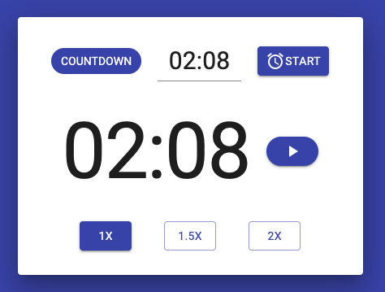
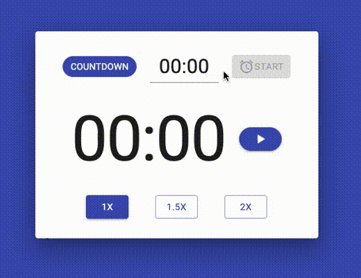
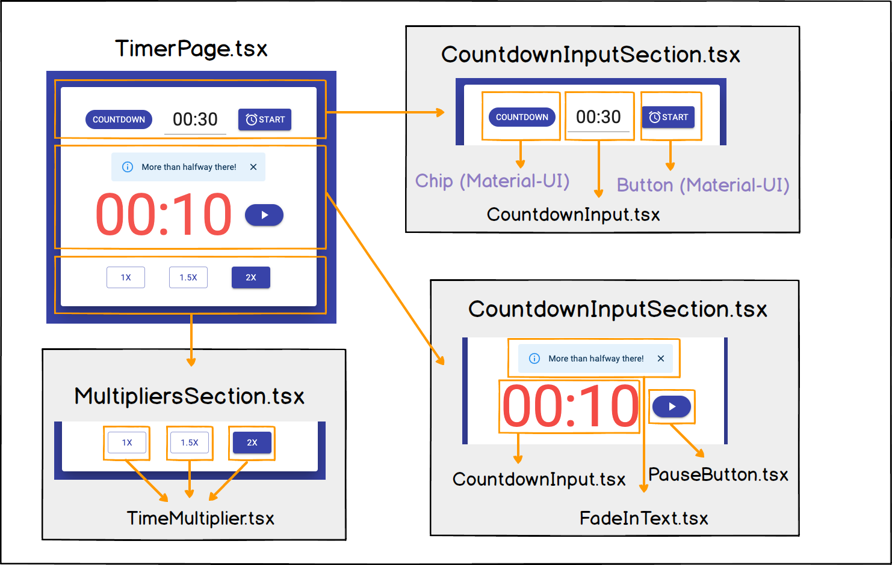
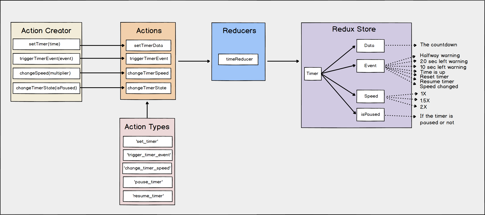

  

<h3 align="center">Timer</h3>

Simple countdown timer

<a href="https://lhbelfanti.gitlab.io/timer/"><strong>➥ Live Demo</strong></a>

    
    

---
# Countdown Timer

## Preview

## Tech stack
- Typescript
- React
- React Redux
- Material UI

## How is it composed?
This is a Single Page Application, so, it has a main component called `TimerPage` and that page has 3 different
sections:

- `CountdownInputSection` in charge of the top part of the timer. It handles the start of the timer.
- `CoundownInputSection` the primary element. It shows the timer, the info panels and handles the pause and resume
  actions.
- `MultipliersSection` the last of the sections that handles the change of the speed of the timer.

A deeper explanation in the following image.

## Redux setup
All the classes for the redux setup are inside the [state](./src/state) folder.

Basically, there are 4 different `Action Creators`, that trigger an `Action`, using the different `Action Types`. Those
actions are received by the `Reducers` and using the data of the payload, it changes the `Redux Store` variables.

See the following image to get a deeper insight of the setup.

## Configuration values
All the configuration values are defined in a single [config.json](./src/pages/config.json). All the properties have a
self-explanatory name.

---
## License

[MIT](https://choosealicense.com/licenses/mit/)